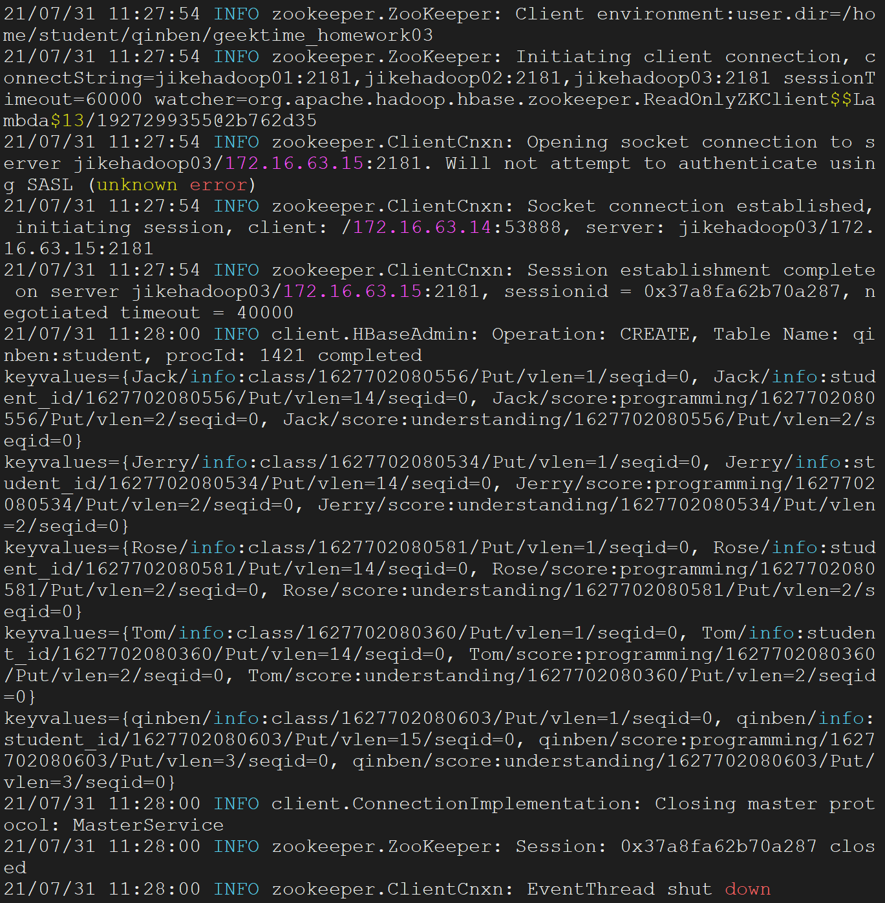
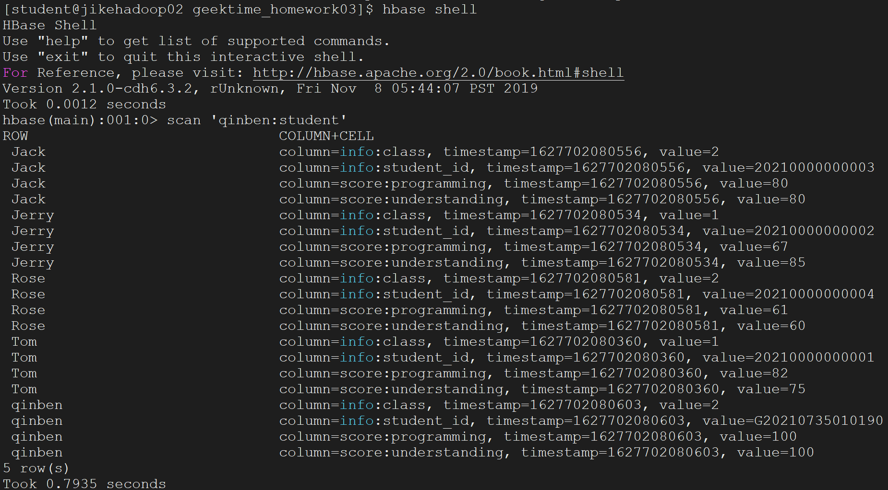

# geektime_homework03
## 1. 基本信息

学号: G20210735010190

## 2. 运行

1. 由于打包jar包时，没有将依赖包含在内，因此运行时，需要添加云服务器上的classpath环境，使用`hbase classpath`获取jar包运行时所需的hbase依赖jar包的路径。

2. 运行命令时使用`java -cp`后接`hbase classpath`获取的路径，再拼接上自己的jar包，最后指定运行主类Main-Class入口，执行命令如下：

   `java -cp /opt/cloudera/parcels/CDH-6.3.2-1.cdh6.3.2.p0.1605554/lib/hbase/bin/../conf:/usr/lib/jvm/java-openjdk/lib/tools.jar:/opt/cloudera/parcels/CDH-6.3.2-1.cdh6.3.2.p0.1605554/lib/hbase/bin/..:/opt/cloudera/parcels/CDH-6.3.2-1.cdh6.3.2.p0.1605554/lib/hbase/bin/../lib/shaded-clients/hbase-shaded-client-byo-hadoop-2.1.0-cdh6.3.2.jar:/opt/cloudera/parcels/CDH-6.3.2-1.cdh6.3.2.p0.1605554/lib/hbase/bin/../lib/client-facing-thirdparty/audience-annotations-0.5.0.jar:/opt/cloudera/parcels/CDH-6.3.2-1.cdh6.3.2.p0.1605554/lib/hbase/bin/../lib/client-facing-thirdparty/commons-logging-1.2.jar:/opt/cloudera/parcels/CDH-6.3.2-1.cdh6.3.2.p0.1605554/lib/hbase/bin/../lib/client-facing-thirdparty/findbugs-annotations-1.3.9-1.jar:/opt/cloudera/parcels/CDH-6.3.2-1.cdh6.3.2.p0.1605554/lib/hbase/bin/../lib/client-facing-thirdparty/htrace-core4-4.2.0-incubating.jar:/opt/cloudera/parcels/CDH-6.3.2-1.cdh6.3.2.p0.1605554/lib/hbase/bin/../lib/client-facing-thirdparty/log4j-1.2.17.jar:/opt/cloudera/parcels/CDH-6.3.2-1.cdh6.3.2.p0.1605554/lib/hbase/bin/../lib/client-facing-thirdparty/slf4j-api-1.7.25.jar:/etc/hadoop/conf:/opt/cloudera/parcels/CDH-6.3.2-1.cdh6.3.2.p0.1605554/lib/hadoop/libexec/../../hadoop/lib/*:/opt/cloudera/parcels/CDH-6.3.2-1.cdh6.3.2.p0.1605554/lib/hadoop/libexec/../../hadoop/.//*:/opt/cloudera/parcels/CDH-6.3.2-1.cdh6.3.2.p0.1605554/lib/hadoop/libexec/../../hadoop-hdfs/./:/opt/cloudera/parcels/CDH-6.3.2-1.cdh6.3.2.p0.1605554/lib/hadoop/libexec/../../hadoop-hdfs/lib/*:/opt/cloudera/parcels/CDH-6.3.2-1.cdh6.3.2.p0.1605554/lib/hadoop/libexec/../../hadoop-hdfs/.//*:/opt/cloudera/parcels/CDH/lib/hadoop-mapreduce/.//*:/opt/cloudera/parcels/CDH-6.3.2-1.cdh6.3.2.p0.1605554/lib/hadoop/libexec/../../hadoop-yarn/lib/*:/opt/cloudera/parcels/CDH-6.3.2-1.cdh6.3.2.p0.1605554/lib/hadoop/libexec/../../hadoop-yarn/.//*:/etc/hadoop/conf/opt/cloudera/parcels/CDH-6.3.2-1.cdh6.3.2.p0.1605554/bin/../lib/hadoop/*:/opt/cloudera/parcels/CDH-6.3.2-1.cdh6.3.2.p0.1605554/bin/../lib/hadoop/lib/*:/opt/cloudera/parcels/CDH-6.3.2-1.cdh6.3.2.p0.1605554/bin/../lib/zookeeper/*:/opt/cloudera/parcels/CDH-6.3.2-1.cdh6.3.2.p0.1605554/bin/../lib/zookeeper/lib/*:qinben_geektime_homework03-1.0-SNAPSHOT.jar me.qinben.hbase.HBaseClientDemo`，感觉命令太长了，试了一下用将`-cp`后的参数替换为```hbase class`:qinben_geektime_homework03-1.0-SNAPSHOT.jar``也是可以的。
   
3. 完整命令如下：

   ```shell
   cd qinben/geektime_homework03
   java -cp `hbase classpath`:qinben_geektime_homework03-1.0-SNAPSHOT.jar me.qinben.hbase.HBaseClientDemo
   
   ```

4. 部分运行截图如下：



5. 使用`hbase shell`查看创建的表

```shell
hbase(main):001:0> scan 'qinben:student'

ROW                             COLUMN+CELL
 Jack                           column=info:class, timestamp=1627702080556, value=2
 Jack                           column=info:student_id, timestamp=1627702080556, value=20210000000003
 Jack                           column=score:programming, timestamp=1627702080556, value=80
 Jack                           column=score:understanding, timestamp=1627702080556, value=80
 Jerry                          column=info:class, timestamp=1627702080534, value=1
 Jerry                          column=info:student_id, timestamp=1627702080534, value=20210000000002
 Jerry                          column=score:programming, timestamp=1627702080534, value=67
 Jerry                          column=score:understanding, timestamp=1627702080534, value=85
 Rose                           column=info:class, timestamp=1627702080581, value=2
 Rose                           column=info:student_id, timestamp=1627702080581, value=20210000000004
 Rose                           column=score:programming, timestamp=1627702080581, value=61
 Rose                           column=score:understanding, timestamp=1627702080581, value=60
 Tom                            column=info:class, timestamp=1627702080360, value=1
 Tom                            column=info:student_id, timestamp=1627702080360, value=20210000000001
 Tom                            column=score:programming, timestamp=1627702080360, value=82
 Tom                            column=score:understanding, timestamp=1627702080360, value=75
 qinben                         column=info:class, timestamp=1627702080603, value=2
 qinben                         column=info:student_id, timestamp=1627702080603, value=G20210735010190
 qinben                         column=score:programming, timestamp=1627702080603, value=100
 qinben                         column=score:understanding, timestamp=1627702080603, value=100
5 row(s)
Took 0.7935 seconds

```



## 3. 主要代码目录结构
```
│  geektime_homework03.iml
│  pom.xml
|
├─logs
│      bagedate.log
│      root.log
├─src
│  ├─main
│  │  ├─java
│  │  │  └─me
│  │  │      └─qinben
│  │  │          └─hbase
│  │  │                  HBaseClientDemo.java
│  │  │                  HBaseConn.java
│  │  │                  HBaseUtil.java
│  │  │
│  │  └─resources
│  │          hbase-site.xml
│  │          log4j.properties
│  │
│  └─test
│      └─java
└─target
    │  qinben_geektime_homework03-1.0-SNAPSHOT.jar
    │
    ├─classes
    │  │  hbase-site.xml
    │  │  log4j.properties
    │  │
    │  └─me
    │      └─qinben
    │          └─hbase
    │                  HBaseClientDemo.class
    │                  HBaseConn.class
    │                  HBaseUtil.class
```

其中`HBaseClientDemo`为运行主类，`HBaseConn`是管理HBase连接的类，`HBaseUtil`是HBase工具类，实现了创建表、删除表、添加数据、删除数据、单rowKey查询、全表查询功能。
